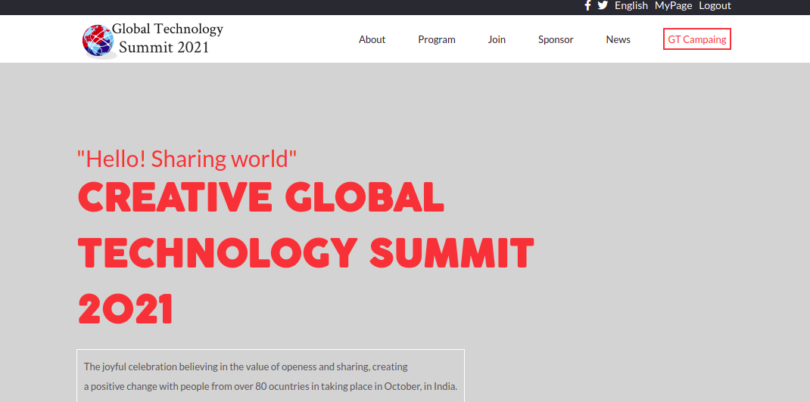
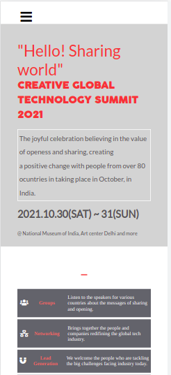

# Capstone Project: Global technology summit 2021

> Global technology summit.

Desktop Page.

Mobile page

## Built With

- Html&Css
- Media queries
- Linters
- JavaScript
## Live Demo

The live page is:
[Live Link](https://aakbarkhan.github.io/capstone-project/)

## Getting Started

- This is an example of how you may give instructions on setting up your project locally. Modify this file to match your project, remove sections that don't apply. For example: delete the testing section if the currect project doesn't require testing.

- To get a local copy up and running follow these simple example steps.

## Install

- In github, clone: https://github.com/aakbarkhan/capstone-project.git

## Authors

👤 **Aku**

- GitHub: [@aakbarkhan](https://github.com/aakbarkhan)

## 🤝 Contributing

Contributions, issues, and feature requests are welcome!

Feel free to check the [issues page](../../issues/).

## Show your support

Give a ⭐️ if you like this project!

## Acknowledgments

- Templated inspired by Cindy Shin https://www.behance.net/gallery/29845175/        CC-Global-Summit-2015.
- Photo by Christopher Campbell on Unsplash
- Standup teams, coding partners.

## 📝 License

This project is [MIT](./MIT.md) licensed.
